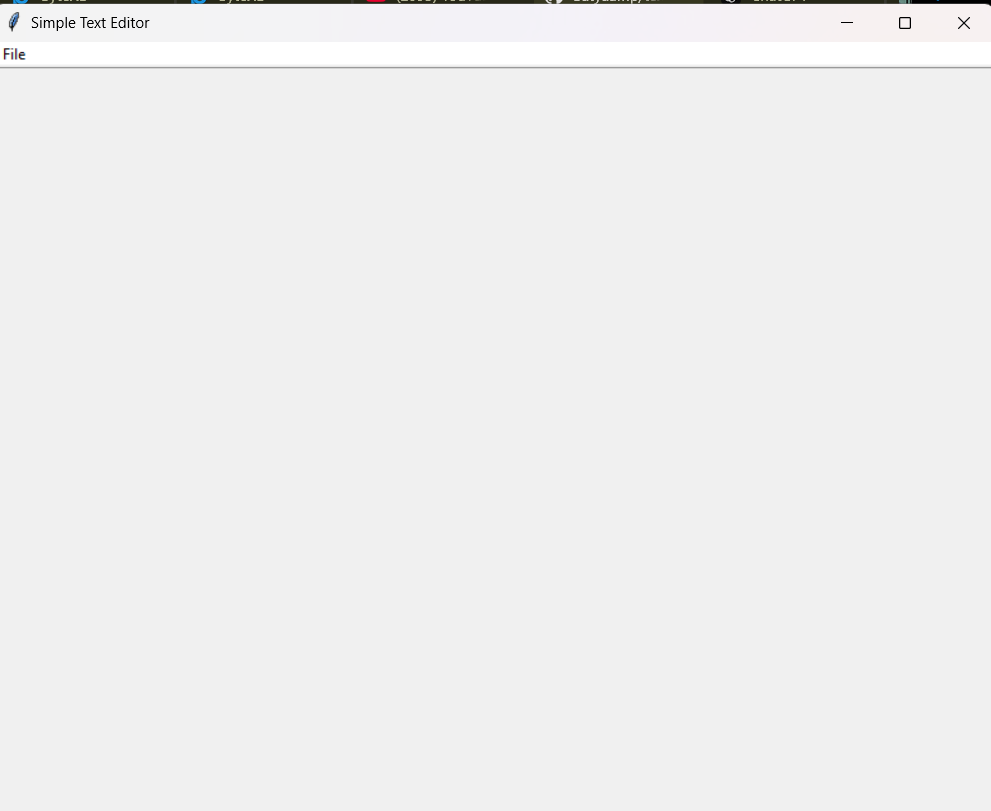
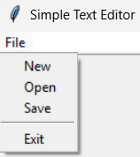

# 📝 **Simple Text Editor** 

A simple text editor built using Tkinter in Python. This application allows users to create, open, edit, and save text files. It features a basic file menu and customizable text options.

---

## 🎯 **Features**
- **📄 Create New File**: Start a new text document.
- **📂 Open Existing File**: Load and view text files.
- **💾 Save File**: Save the current text document.
- **✂️ Basic Editing Functions**: Cut, copy, and paste text.
- **🌟 Simple, Interactive User Interface**: Clean and user-friendly design.
- **📊 Status Bar**: Displays line and column numbers.

---

## 🛠️ **Tech Stack**
- **Frontend**: Tkinter (For creating the graphical user interface)
- **Backend**: Python (For logic and functionality)

---

## 🔧 **Installation** 

Follow these steps to set up the project locally:

1. **Clone the repository**:
   ```bash
   git clone https://github.com/Satyaamp/text-editor-tkinter.git
   ```


2. **Run the application**:
   ```bash
   python text_editor.py
   ```

---

## 🖼️ **App Screenshot**




---

## 🎨 **UI Design**
The app features a minimalistic design with a focus on usability. The user interface includes:
- **File Menu**: With options for creating, opening, saving, and exiting files.
- **Text Area**: For writing and editing text.

---

## ⚙️ **Future Enhancements**
- **📝 Multi-tab Support**: Add functionality to open multiple documents at the same time.
- **🔍 Search and Replace**: Implement a search and replace feature.
- **💡 Dark Mode**: Add a dark theme for nighttime editing.

---

## 💬 **Contribute**
We welcome contributions! 🎉

Feel free to fork the repository, open issues, and submit pull requests. 🚀

---

## 💻 **Contact**
For any questions or assistance, feel free to reach out via email:  
**cbse821@gmail.com** ✉️

---